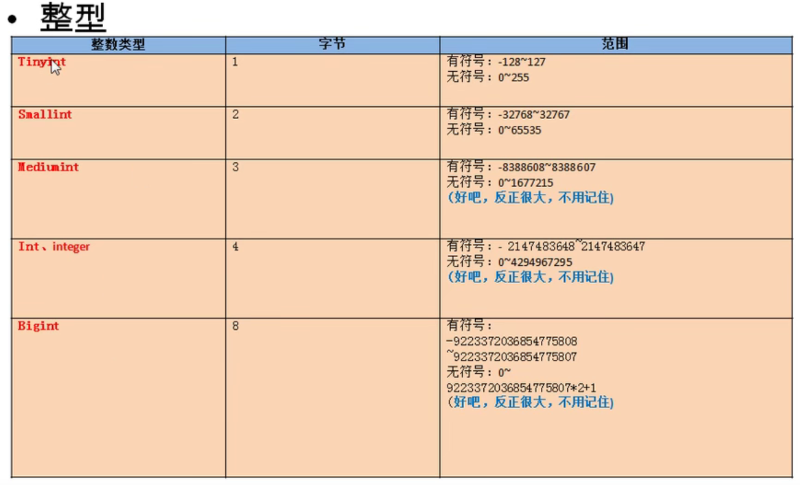
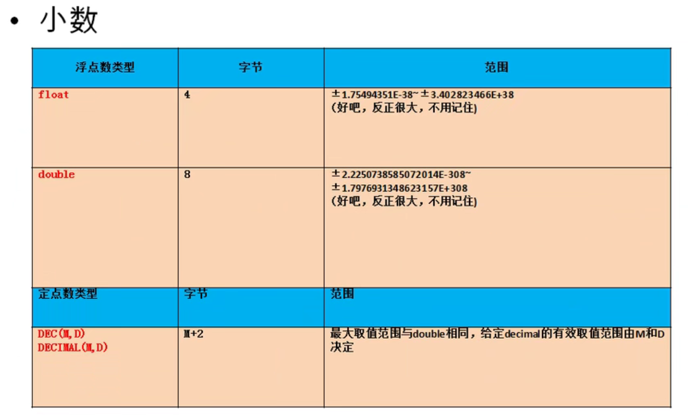
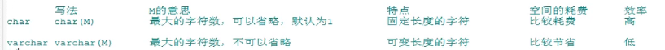
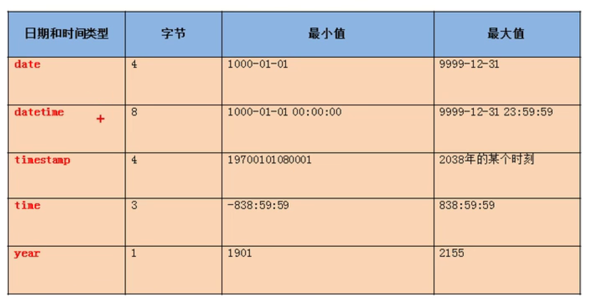
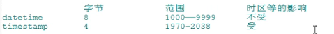

# 进阶11DDL语言

数据定义语言

库和表的管理

- 库的管理（创建，修改，删除）
- 表的管理（创建，修改，删除）

创建：create

修改：alter

删除：drop

# 库的管理

## 库的创建

语法

```sql
create database (if not exists)库名;
```


```sql
#创建库books
create database if not exists books;
```

## 库的修改

更改库的字符集

```sql
alter database books character set gbk;
```

## 库的删除

```sql
drop database if exists books;
```

# 表的管理

## 表的创建

语法

```sql
create table 表名(
	列名 列的类型【（长度） 约束】,
    列名 列的类型【（长度） 约束】,
    列名 列的类型【（长度） 约束】,
    ...
    列名 列的类型【（长度） 约束】
)
```

```sql
#创建表book
create table if not exists book(
	id int,#编号
    bname varchar(20),#图书名
    price double,#价格
    authorid int,#作者编号
    publishdate datetime#出版日期
)

#创建表author
create table author(
	id int,
    au_name varchar(20),
    nation varchar(10)
)
```

## 表的修改

- 修改列名
- 修改列的类型或约束
- 添加新列
- 删除列
- 修改表名

==语法==

```sql
alter table 表名 add|drop|modify|change column 列名【列类型 约束】;
```


```sql
#修改列名
alter table book change column publishdate pubDate datetime;

#修改列的类型
alter table book modify column pubdate timestamp;

#添加列
alter table author add column annual double;

#删除列
alter table author drop column annual;

#修改表名
alter table author rename to book_author;
```

## 表的删除

```sql
drop table if exists book_author;
```

## 通用的写法

```sql
drop database if exists 旧库名；
create database 新库名;

drop table if exists 旧表名;
create table 表名();
```

## 表的复制

- 复制表的结构
- 复制表的结构+数据
- 复制表的结构+部分数据
- 复制某些字段

```sql
#仅仅复制表的结构
create table copy like author;

#复制表的结构加数据
create table copy2
select * from author;

#复制表的结构+部分数据
create table copy3
select id,au_name
from author
where nation='中国';

#仅仅复制某些字段
create table copy4
select id,au_name
from author
where 1=2;
```

# 常见的数据类型

- 数值型：整型，小数（定点数，浮点数）
- 字符型：较短的文本（char,varchar），较长的文本(text,blob较长的二进制数据)
- 日期型

## 整型



分类：

tinyint,smallint,mediumint,int/integer,bigint

特点：

- 如果不设置无符号还是有符号，默认是有符号；设置无符号，需要添加unsigned关键字
- 如果插入的数值超出了整型的范围，汇报out of range异常，并且插入临界值
- 如果不设置长度，会有默认的长度，长度代表了显示的最大宽度，如果不够会用0在左边填充，但必须搭配zerofill使用

```sql
#如何设置无符号和有符号
create table tab_int(
	t1 int,
    t2 int unsigned
);
```

## 小数



浮点型

- float(M,D)
- double(M,D)

定点型

- dec(M,D)
- decimal(M,D)

特点

- M:整数部位+小数部位，D：小数部位，如果超过范围，则插入临界值
- M,D可省略，如果是decimal，默认M为10，D为0；如果是float或double，则会根据插入的数值的精度来决定精度
- 定点型的精确度较高，如果要求插入数值的精度较高如货币运算等则考虑使用

原则

所选择的类型越简单越好，能保存数值的类型越小越好

## 字符型

- 较短的文本(char,varchar)

  其他：

  - binary和varbinary用于保存较短的二进制
  - enum用于保存枚举
  - set用于保存集合

- 较长的文本(text,blob(较大而二进制))


==字符数：'a'和'中'都是一个字符==

特点：

 

## 日期型



分类

- date只保存日期
- time只保存时间
- year只保存年
- datetime保存日期+时间
- timestamp保存日期+时间

特点



# 常见约束

含义：一种限制，用于限制表中的数据，为了保证表中的数据的准确性和可靠性

```sql
create table 表名(
	字段名 字段类型 约束
)
```

分类：六大约束

- not null 非空，用于保证该字段的值不能为空，比如姓名、学号等
- default 默认，用于保证该字段有默认值，比如性别
- primary key 主键，用于保证该字段的值具有唯一性，并且非空，比如学号、员工编号等
- unique 唯一、用于保证该字段的值具有唯一性，可以为空，比如座位号
- check 检查约束（mysql不支持）比如年龄、性别
- foreign key 外键，用于限制两个表的关系，用于保证该字段的值必须来自于主表的关联列的值，==在从表添加外键约束，用于引用主表中某列的值==，如学生表的专业编号，员工表的部门编号，员工表的工种编号

添加约束的时机：

- 创建表时
- 修改表时

约束的添加分类

- 列级约束

  - 六大约束语法上都支持，但外键约束没有效果

- 表级约束

  - 除了非空、默认，其他都支持

- ```sql
  create table 表名(
  	字段名 字段类型 列级约束,
      字段名 字段类型,
      表级约束
  )
  ```

  

## 创建表时添加约束

### 列级约束

语法

```sql
直接在字段名和类型后面追加 约束类型即可
只支持：默认、非空、主键、唯一
```


```sql
use students;
create table stuinfo(
	id int primary key, #主键约束
    stuName varchar(20) not null, #非空
    gender char(1) check(gender='男' or gender='女'), #检查
    seat int unique, #唯一
    age int defeault 18 #默认约束
);

create table major(
	id int primary key,
    majorname varchar(20)
)

#查看stuinfo表中所有的索引，包括主键、外键、唯一
show index from stuinfo;
```

### 表级约束

语法

```sql
在各个字段的最下面

【constraint 约束名 】约束类型（字段名）
```


```sql
create table(
	id int,
    stuname varchar(20),
    gender char(1),
    seat int,
    age int,
    majorid int,
    
    constraint pk primary key(id), #主键
    constraint uq unique(seat), #唯一键
    constraint ck check(gender='男' or gender='女'), #检查
    constraint fk_stuinfo_major foreign key(majorid) references major(id) #外键
);
```

### 通用的写法

```sql
create table if not exists stuinfo(
	id int primary key,
    stuname varchar(20) not null,
    sex char(1),
    age int default 18,
    seat int unique,
    majorid int,
    constraint fk_stuinfo_major foreign key(majorid) references major(id)
);
```

## 主键和唯一对比


==组合键即两个键共同组合成主键或唯一，当且仅当两个键都一样时，构成重复==

==唯一键可以为空，但是一个表中只能由一个空==

## 外键

- 要求在从表设置外键关系
- 从表的外界列的类型和主表的关联列的类型要求一致或兼容，名称无要求
- ==主表中的关联列必须是一个key（一般是主键或唯一）==
- 插入数据时，先插入主表，再插入从表；删除数据，先删除从表，再删除主表

## 修改表时添加约束

语法

```sql
#列级约束
alter table 表名 modify column 字段名 字段类型 新约束;
#表级约束
alter table 表名 add 【constaint 约束名】约束类型（字段名）【外键的引用】
```


### 添加非空约束

```sql
alter table stuinfo modify column stuname varchar(20) not null;
```

### 默认约束

```sql
alter table stuinfo modify column age int default 18;
```

### 主键

```sql
#列级约束
alter table stuinfo modify column id int primary key;
#表级约束
alter table stuinfo add primary key(id);
```

### 唯一

```sql
#列级约束
alter table stuinfo modify column seat int unique;
#表级约束
alter table stuinfo add unique(seat);
```

### 外键

```sql
#表级约束
alter table stuinfo add constraint fk_stuinfo_major foreign key(majorid) references major(id);
```

## 修改表时删除约束

```sql
#删除非空约束
alter table stuinfo modify column stuname varchar(20) null;
#删除默认约束
alter table stuinfo modify column age int;
#删除主键
alter table stuinfo drop primary key;
#删除唯一
alter table stuinfo drop index seat;
#删除外键
alter table stuinfo drop foreign key fk_stuinfo_major;
```

# 标识列

又称为自增长列

含义：可以不用手动的插入值，系统提供默认的序列值

## 创建表时设置标识列

```sql
create table if not exists tab_identity(
	id int primary key auto_increment,
    name varchar(20)
);
```

特点

- 标识列必须和主键搭配吗？不一定，但要求是一个key
- 一个表可以有几个标识列？至多一个
- 标识列的类型只能是数值型
- 标识列可以通过set auto_increment_increment=3；设置步长；可以通过手动插入值，设置起始值

## 修改表时设置标识列

```sql
alter table tab_identity modify column id int primary key auto_increment;
```

## 修改表时删除标识列

```sql
alter table tab_identity modify column id int primary key;
```

