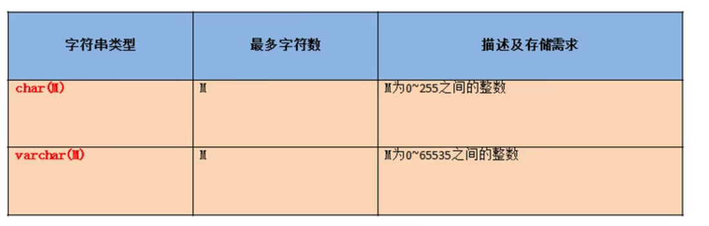

# 进阶11DDL语言

数据定义语言

库和表的管理

- 库的管理（创建，修改，删除）
- 表的管理（创建，修改，删除）

创建：create

修改：alter

删除：drop

# 库的管理

## 库的创建

语法

```sql
create database (if not exists)库名;
```


```sql
#创建库books
create database if not exists books;
```

## 库的修改

更改库的字符集

```sql
alter database books character set gbk;
```

## 库的删除

```sql
drop database if exists books;
```

# 表的管理

## 表的创建

语法

```sql
create table 表名(
	列名 列的类型【（长度） 约束】,
    列名 列的类型【（长度） 约束】,
    列名 列的类型【（长度） 约束】,
    ...
    列名 列的类型【（长度） 约束】
)
```

```sql
#创建表book
create table if not exists book(
	id int,#编号
    bname varchar(20),#图书名
    price double,#价格
    authorid int,#作者编号
    publishdate datetime#出版日期
)

#创建表author
create table author(
	id int,
    au_name varchar(20),
    nation varchar(10)
)
```

## 表的修改

- 修改列名
- 修改列的类型或约束
- 添加新列
- 删除列
- 修改表名

==语法==

```sql
alter table 表名 add|drop|modify|change column 列名【列类型 约束】;
```


```sql
#修改列名
alter table book change column publishdate pubDate datetime;

#修改列的类型
alter table book modify column pubdate timestamp;

#添加列
alter table author add column annual double;

#删除列
alter table author drop column annual;

#修改表名
alter table author rename to book_author;
```

## 表的删除

```sql
drop table if exists book_author;
```

## 通用的写法

```sql
drop database if exists 旧库名；
create database 新库名;

drop table if exists 旧表名;
create table 表名();
```

## 表的复制

- 复制表的结构
- 复制表的结构+数据
- 复制表的结构+部分数据
- 复制某些字段

```sql
#仅仅复制表的结构
create table copy like author;

#复制表的结构加数据
create table copy2
select * from author;

#复制表的结构+部分数据
create table copy3
select id,au_name
from author
where nation='中国';

#仅仅复制某些字段
create table copy4
select id,au_name
from author
where 1=2;
```

# 常见的数据类型

- 数值型：整型，小数（定点数，浮点数）
- 字符型：较短的文本（char,varchar），较长的文本(text,blob较长的二进制数据)
- 日期型

## 整型


分类：

tinyint,smallint,mediumint,int/integer,bigint

特点：

- 如果不设置无符号还是有符号，默认是有符号；设置无符号，需要添加unsigned关键字
- 如果插入的数值超出了整型的范围，汇报out of range异常，并且插入临界值
- 如果不设置长度，会有默认的长度，长度代表了显示的最大宽度，如果不够会用0在左边填充，但必须搭配zerofill使用

```sql
#如何设置无符号和有符号
create table tab_int(
	t1 int,
    t2 int unsigned
);
```

## 小数


浮点型

- float(M,D)
- double(M,D)

定点型

- dec(M,D)
- decimal(M,D)

特点

- M:整数部位+小数部位，D：小数部位，如果超过范围，则插入临界值
- M,D可省略，如果是decimal，默认M为10，D为0；如果是float或double，则会根据插入的数值的精度来决定精度
- 定点型的精确度较高，如果要求插入数值的精度较高如货币运算等则考虑使用

原则

所选择的类型越简单越好，能保存数值的类型越小越好

## 字符型

- 较短的文本(char,varchar)

  其他：

  - binary和varbinary用于保存较短的二进制
  - enum用于保存枚举
  - set用于保存集合

- 较长的文本(text,blob(较大而二进制))



==字符数：'a'和'中'都是一个字符==

特点：

 

## 日期型


分类

- date只保存日期
- time只保存时间
- year只保存年
- datetime保存日期+时间
- timestamp保存日期+时间

特点


