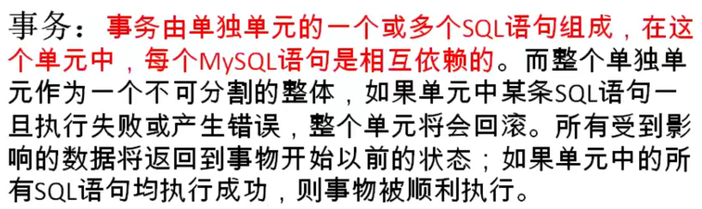
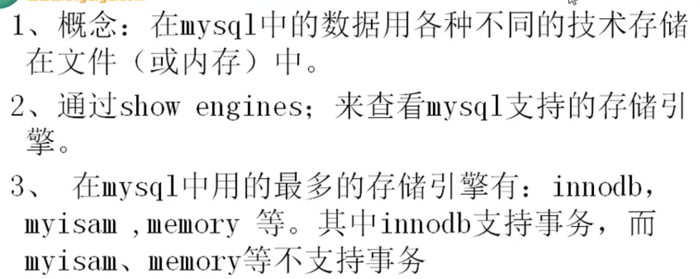
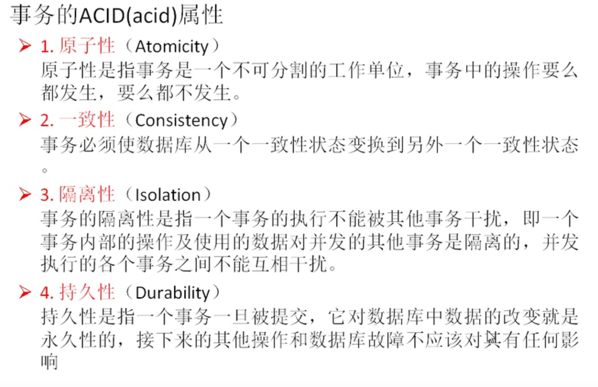
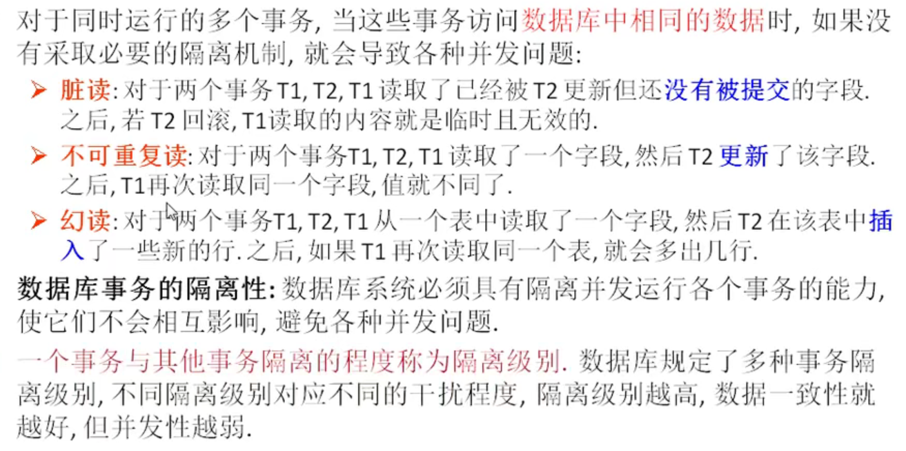
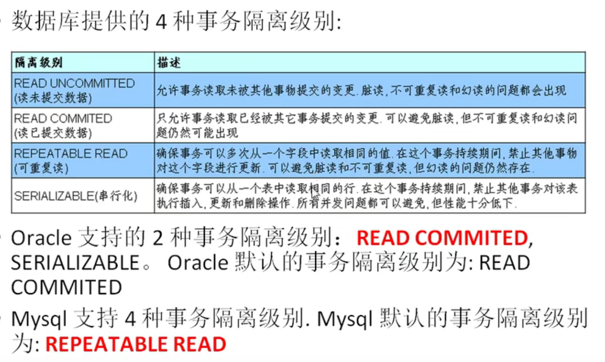
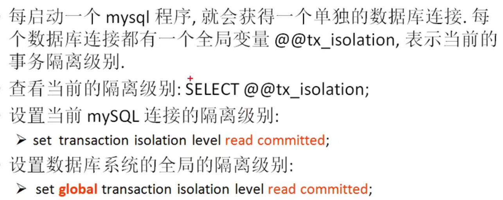

# 进阶12TCL语言

transaction control language

事务控制语言

事物：

一个或一组sql语句组成一个执行单元，这个执行单元要么全部执行，要么全部不执行

案例：转账

张三丰   1000

郭襄        1000

update 表 set 张三丰的余额=500 where name='张三丰'

update 表 set 郭襄的余额=1500 where name='郭襄'



存储引擎



==事物的ACID属性：==



## 事务的创建

事物分类

- 隐式事物：事物没有明显的开启和结束的标记，如insert,update,delete语句
- 显式事物：事物具有明显的开启和结束的标记，==前提：必须先设置自动提交功能为禁用==

```sql
set autocommit=0;
```

步骤：

1. 开启事务

   ```sql
   set autocommit=0;
   start transaction;#可选的
   ```

2. 编写事务中的sql语句（select,insert,update,delete）

   ```sql
   语句1；
   语句2；
   ...
   ```

3. 结束事务

   ```sql
   commit; #提交事务
   rollback; #回滚事务
   ```

```sql
#演示事务的使用步骤
#开启事务
set autocommit=0;
start transaction;
#编写一组事务的语句
update account set balance=500 where username='张无忌';
update account set balance=1500 where username='赵敏';

#结束事务
#commit;
rollback;
```

## delete和truncate在事务使用时的区别

```sql
#delete
set autocommit=0;
start transaction;
delete from account;
rollback;

#truncate
set autocommit=0;
start transaction;
truncate table account;
rollback;
```

==区别==

- delete支持回滚
- truncate回滚无效

## 并发问题







事务的隔离级别：

​                                            脏读                              不可重复读               幻读

read uncommitted               yes                                  yes                            yes

read committed                   no                                    yes                            yes

repeatable read                   no                                     no                             no

seribalizable                        no                                     no                             no

mysql中默认 第三个隔离级别 repeatable read

orcal中默认第二个隔离级别  read committed

查看隔离界别

select @@tx_isolation;

设置隔离级别

set session|global transaction isolation level 隔离级别;

## 回滚点

```sql
savepoint 节点名;#设置保存点
```

```sql
set autocommit=0;
start transaction;

delete from account where id=25;
savepoint a;#设置保存点
delete from account where id=28;
rollback to a;#回滚到保存点
```

