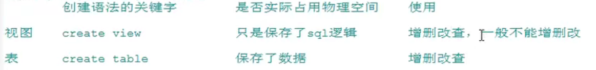

# 进阶13视图

含义：虚拟表，和普通表一样使用

mysql5.1版本出现的虚拟特性，是通过表动态生成的数据

行和列数据来自定义视图的查询中使用的表，并且是在使用视图时动态生成的，==只保存了sql逻辑，不保存查询结果==

应用场景

- 多个地方用到同样的查询结果
- 该查询结果使用的sql语句较复杂

```sql
#查询姓张的学生名和专业名
select stuname,majorname
from stuinfor as s
inner join major as m
on s.majorid=m.id
where s.stuname like '张%';

create view v1
as
select stuname,majorname
from stuinfor as s
inner join major as m
on s.majorid=m.id

select * from v1 where stuname like '张%';
```

## 创建视图

语法

```sql
create view 视图名
as 
查询语句;
```

```sql
#查询姓名中包含a字符的员工名、部门名和工种信息
create view myv1
as
select last_name,department_name,job_title
from employees as e
join departments as d on e.department_id=d.department_id
join jobs as on j.job_id=e.job_id;

select * from myv1 where last_name like '%a%';

#查询各部门的平均工资级别
#创建视图查看每个部门的平均工资
create view myv1
as
select avg(salary) as ag,department_id
from employees 
group by department_id;

select myv2.ag,g.grade_level 
from myv2
inner join job_grades as g
on myv2.ag between g.lowest_sal and g.highest_sal;

#查询平均工资最低的部门信息
select * from myv2 order by ag limit a;

#查询平均工资最低的部门名和工资
create view myv3
as
select * from myv2 order by ag limit;

select d.*,m.ag
from myv3 as m
inner join departments as d
on m.department_id=d.department_id;

```

- 重用sql语句
- 简化复杂的sql操作，不必知道它的查询细节
- 保护数据，提高安全性

## 视图的修改

```sql
#方式一
create or replace view 视图名
as 
查询语句；

#方式二
alter view 视图名
as
查询语句;
```


```sql
create or replace view myv3
as 
select avg(salary),job_id
from employees
group by job_id;

alter view myv2
as
select * from employees;
```

## 删除视图

```sql
drop view 视图名，视图名,...;
```

```sql
drop view myv1,myv2,myv2;
```

## 查看视图

```sql
desc myv3;
show create view myv3;
```

## 视图的更新

```sql
#插入
insert into myv1 values('张飞'，'zf@qq.com');

#修改
update myv1 set last_name='张无忌' where last_name='张飞';

#删除
delete from myv1 where last_name='张无忌';
```

==视图的可更新性和视图中的查询的定义有关系，以下类型的视图是不能更新的==

- 包含一些关键字的sql语句：分组函数，distinct，group by，having，union或者union all
- 常量视图
- select中包含子查询
- join
- from一个不能更新的视图
- where子句的子查询引用了from子句中的表

## 视图与表对比



