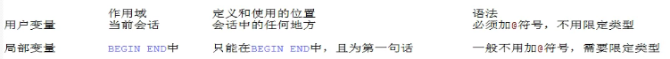

# 进阶14变量

- 系统变量
  - 全局变量
  - 会话变量
- 自定义变量
  - 用户变量
  - 局部变量

## 系统变量

说明：变量由系统提供，不是用户定义，属于服务器层面

使用的语法

```sql
#查询所有的系统变量
show global|[session] variables;

#查看满足条件的部分系统变量
show global|[session] variables like '%char%';

#查看指定的某个系统变量的值
select @@系统变量名;
select @@global|[session].系统变量名;

#为某个系统变量赋值
set global|[session] 系统变量名=值;
方式二
set @@global|[session].系统变量名=值;
```

注意：

==如果是全局级别，则需要加global，如果是会话级别，则需要加session，如果不写，则默认session==

### 全局变量

==作用域：服务器每次启动将为所有的全局变量赋初始值，针对于所有的会话（连接）有效，但不能跨重启==

```sql
#查看所有的全局变量
show global variables;

#查看部分的全局变量
show global variables like '%char%';

#查看指定的全局变量的值
select @@global.autocommit;
select @@tx_isolation;

#为某个指定的全局变量赋值
set @@global.autocommit=0;
```

### 会话变量

==作用域：仅仅针对于当前会话（连接）有效==

```sql
#查看所有的会话变量
show session variables;
show variables;

#查看部分的会话变量
show session variables like '%char%';

#查看指定的会话变量的值
select @@session.tx_isolation;

#为某个会话变量赋值
set @@session.tx_isolation='read-uncommitted';
```

## 自定义变量

说明：变量是用户自定义的，不是由系统的定义

使用步骤：

- 声明
- 赋值
- 使用（查看、比较、运算等）

### 用户变量

==作用域：针对于当前会话（连接）有效，同于会话变量的作用，应用在任何地方，也就是begin end里面或begin end外面==

```sql
复制的操作符:=或:=
#声明并初始化
set @用户变量名=值;
set @用户变量名:值;
select @用户变量名:=值;

#赋值（更新用户变量的值）
#方式一通过set或select
set @用户变量名=值;
set @用户变量名:值;
select @用户变量名:=值;
#方式二通过select into
select 字段 into @变量名 from 表；

#使用（查看用户变量的值）
select @用户变量名;
```

```sql
#声明并初始化
set @name='john';
set @name=100;
set @ocunt=1;

#赋值
select count(*) into @count from emplyees;

#查看
select @count;
```

### 局部变量

==作用域：仅仅在定义它的begin end中有效，应用在begin end中，并且定义必须是第一句话==

- 声明
- 赋值
- 使用

```sql
#声明
declare 变量名 类型;
declare 变量名 类型 default 值;

#赋值
#方式一通过set或select
set 局部量名=值;
set 局部变量名:值;
select @用户变量名:=值;
#方式二通过select into
select 字段 into 局部变量名 from 表；

#使用
select 局部变量名;
```

### 对比



```sql
#声明两个变量并赋初始值，求和，并打印
#用户变量
set @m=1;
set @n=2;
set @sum=@m+@n;
select @sum;

#局部变量
declare m int default 1;
declare n int default 2;
declare sum int;
set sum=m+n;
select sum;
#有问题，要在beign end中
```

