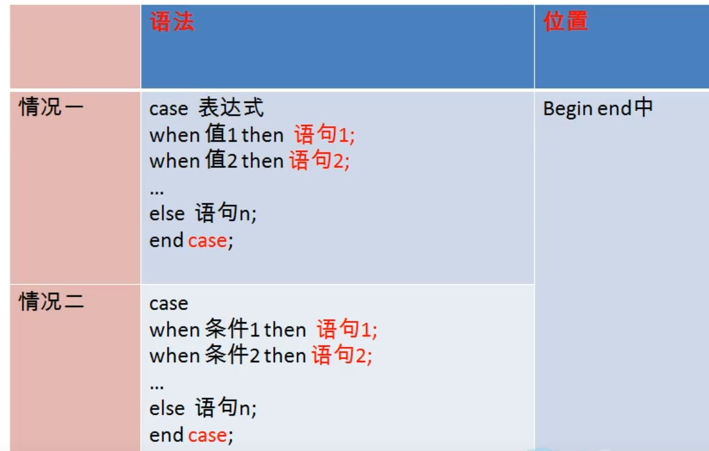
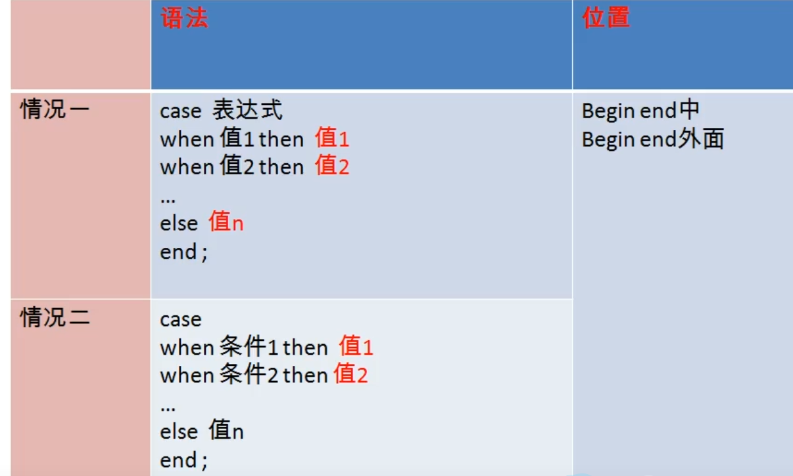
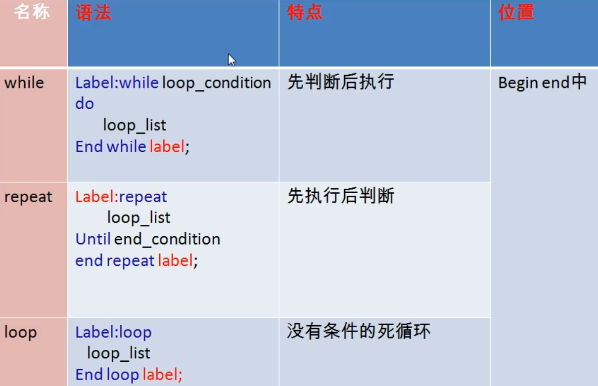

# 进阶15存储过程和函数

存储过程和函数：类似于方法

好处：

- 提高代码的重用性
- 简化操作

# 存储过程

含义：一组预先编译好的sql语句的集合，理解成批处理语句

- 提高代码的重用性
- 简化操作
- 简化了编译次数并且减少了和数据库服务器的连接次数，提高了效率

## 存储过程的创建

1. 调用

1. 创建语法

```sql
#
create procedure 存储过程名(参数列表)
begin
	存储过程体（一组合法的sql语句）
end
```

==注意：==

- 参数列表包含三部分（参数模式  参数名  参数类型）（举例 in stuname varchar(20)）

  参数模式：

  - in: 该参数可以作为输入，也就是该参数需要调用方传入值，in可以省略
  - out:  该参数可以作为输出，也就是该参数可以作为返回值
  - inout: 该参数既可以作为输入也可以作为输出，也就是该参数既需要传入值，也可以返回值

- 如果存储过程体仅仅只有一句话，begin end可以省略

- ==存储过程体中的每条sql语句的结尾要求必须加分号==

- 存储过程的结尾可以使用delimiter重新设置

  语法：

  delimiter 结束标记

  例如delimiter $

1. 调用语法

   ```sql
   call 存储过程名(实参列表);
   ```

   

```sql

#空参列表
#插入到admin表中五条记录
delimiter $
create procedure myp1()
begin 
	insert into admin(username,password)
    values('john1','0000'),('lily','0000'),('rose','0000'),('jace','0000'),('tom','0000');
end $

call myp1();

#带in模式参数的存储过程
#创建存储过程实现根据女神名，查询对应的男神信息
create procedure myp2(in beautyname varchar(20))
begin
	select bo.*
	from boys bo
	right join beauty b on bo.id=b.boyfriend_id
	where b.name=beautyname;
end $

call myp2('柳岩')$;
#创建存储过程实现，用户是否登录成功
create procedure myp3(in username varchar(20),in password vacchar(20))
begin
	declare result varchar(20) default '';
	select count(*) into result
	from admin
	where admin.username=username
	and admin.password=passsword;
	
	select result;
end $

call myp3('张飞','8888');

create procedure myp4(in username varchar(20),in password vacchar(20))
begin
	declare result int default 0; #声明并初始化
	select count(*) into result   #赋值
	from admin
	where admin.username=username
	and admin.password=passsword;
	
	select if(result>0,'成功','失败');  #使用
end $

call myp4('张飞','8888');

#带out模式的存储过程
#根据女神名，返回对应的男神名
create procedure myp5(in beautyname varchar(20),out boyname varchar(20))
begin
	select bo.boyname into boyname
	from boysname as bo
	inner join beauty as b on bo.id=b.boyfriend_id
	where b.name=beautyname;
end $

set @bname$;
call myp5('小昭',@bname)$
select @bname$

#根据女神名，返回对应的男神名和男神魅力值
create procedure myp6(in beautyname varchar(20),out boyname varchar(20),out userCP int)
begin
	select bo.boyname,bo.userCP into boyname,userCP
	from boysname as bo
	inner join beauty as b on bo.id=b.boyfriend_id
	where b.name=beautyname;
end $

call myp6('小昭',@bname,@username)$


#带inout模式参数的存储过程
#传入a和b两个值，最终a和b都翻倍并返回
create procedure myp8(inout a int,inout b int)
begin
	set a=a*2;
	set b=b*2;
end $

set @m=10$;
set @n=20$;
call myp8(@m,@n)$;
select @m,@n;
```

## 存储过程的删除

语法

```sql
drop procedure 存储过程名;

drop procedure p1;
```

## 查看存储过程的信息

```sql
show create procedure 存储过程名;

show create procedure myp2;
```

# 函数

含义：一组预先编译好的sql语句的集合，理解成批处理语句

- 提高代码的重用性
- 简化操作
- 简化了编译次数并且减少了和数据库服务器的连接次数，提高了效率

区别

存储过程：可以有0个返回，也可以有多个返回，适合批量插入、批量更新

函数：有且仅有1个返回，适合做处理数据后返回一个结果

## 函数的创建

语法

```sql
create function 函数名(参数列表) returns 返回类型
begin
 	函数体
end
```


==注意：==

- 参数列表包含两部分：参数名，参数类型

- 函数体：肯定会有return语句，如果没有会报错，如果return语句没有放在函数体的最后也不报错，但不建议

  return 值;

- 函数体中只有一句话，则可以省略begin end

- 使用delimiter语句设置结束标记

## 调用

```sql
select 函数名（参数列表）;
```

```sql
#无参有返回
create function myf1() returns int
begin
	declare c int default 0;
	select count(*) into c
	from employees;
	return c;
end $

select myf1()$

#有参有返回
#根据员工名返回他的工资
create function myf2(empname varchar(20)) returns double
begin
	set @sal=0;#定义用户变量
	select salary into @sal #赋值
	from employees
	where last_name=empname;
	return @sal;
end $

select myf2('k_ing') $

#根据部门名，返回该部门的平均工资
create function myf3(depname varchar(20))returns double
begin
	declare sal double;
	select avg(salary) into sal
	from employees as e
	joinn departments as d on e.department_id=d.department_id
	where d.department_name=departname;
	return sal;
end

select myf2('IT')$
```

## 查看

```sql
show create function myf3;
```

## 删除函数

```sql
drop function myf3;
```

```sql
#创建函数，实现传入两个float，返回二者之和
create function test_fun1(num1 float ,num2 float) returns float
begin
	declart sum float default 0;
	select sum=num1+num2;
	return sum;
end $

select test_fun1(1,2)$
```

# 流程控制结构

- 顺序结构：程序从上往下依次执行
- 分支结构：程序可以从两条或多条路径中选择一条去执行
- 循环结构：程序在满足一定条件的基础上，重复执行一段代码

## 分支结构

### if函数

功能：实现简单的双分支

==可以作为表达式放在任何位置==

语法

```sql
select if(表达式1，表达式2，表达式3);

执行顺序：
如果表达式1成立，则if函数返回表达式2的值，否则返回表达式3的值
```

应用：任何地方

### case结构

```sql
#情况1
#类似于switch语句，一般用于实现等值判断
#语法
case 变量|表达式|字段
when 要判断的值 then 返回值1或语句1；
when 要判断的值 then 返回值2或语句2；
...
else 返回值n或语句n；
end [case];

#情况2
#类似于多重if语句，一般用于实现区间判断
case
when 要判断的条件1 then 返回值1或语句1;
when 要判断的条件2 then 返回值2或语句2;
...
else 返回值n或语句n;
end case;

```

特点：

- 可以作为表达式，嵌套在其他语句中使用，==可以放在任何地方，begin end 中或begin end的外面==，如果放在begin end外面，作为表达式结合其他语句使用；如果放在begin　ｅｎｄ里面，一般作为独立的语句使用
- 可以作为独立的语句去使用，只能放在begin end中
- 如果when中的值满足或条件成立，则执行对应的then后面的语句，并且结束case；如果不满足，则执行else中的语句或值
- else可以省略，如果else省略了，并且所有when条件都不满足，则返回null

独立语句



作为表达式



```sql
#创建存储过程，根据传入的成绩，来显示等级，比如传入的成绩：90-100，显示A；80
create procedure test_case(in score int)
begin
	case
	when score >=90 and score<=100 then select 'A';
	when score>=80 then select 'B';
	when score>=60 then select 'C';
	else select 'D'
	end case;
end $

call test_case(95)$
```

### if结构

功能：实现多重分支

语法

```sql
if 条件1 then 语句1;
elseif 条件2 then 语句2;
...
[else 语句n;]
end if;
```

==应用场合：应用在begin end中==

```sql
#根据传入的成绩，来显示等级，比如传入的成绩：90-100，返回A；80-90，返回B；60-80，返回C；否则，返回D
create function test_if(score int)returns char(1)
begin
	if score>=90 and score<=100 then return 'A';
	if score>=80 then return 'B';
	if score>=60 then return 'C';
	else return 'D'
	end if;
end $
```

## 循环结构

==必须放在begin end中==

分类

while,loop,repeat

循环控制：

iterate类似于continue，基于，结束本次循环，继续下一次

leave 类似于break,跳出，结束当前所在的循环

### while

语法

```sql
【标签:】while 循环条件 do
	循环体;
end while 【标签】;
```

```sql
#批量插入，根据次数插入到admin表中过条记录
create procedure pro_while1(in insertcount int)
begin
	declare i int default 1;
	while i<=insertcount do
		insert into admin(username,password) values(concat('rose',i),'666');
		set i=i+1;
	end while;
end $

call pro_while(100)$

#添加leave语句
#批量插入，根据次数插入到admin表中多条记录，如果次数>20则停止
truncate table admin$
drop procedure test_while1$
create procedure test_while1(in insertcount int)
begin
	declare i int default 1;
	a:while(i<=insertcount) do
		insert into admin(username,password) values(concat('rose',i),'666');
		if i>=20 then leave a;
		end if;
		set i=i+1;
	end while a;
end $

call test_while1(100)$

#添加iterate语句
#批量插入，根据次数插入到admin表中多条记录，只插入偶数次
truncate table admin$
drop procedure test_while1$
create procedure test_while1(in insertcount int)
begin
	declare i int default 0;
	a:while(i<=insertcount) do
		set i=i+1;
		if mod(i,2)!=0 then iterate a;
		end if;
		insert into admin(username,password) values(concat('rose',i),'666');
	end while a;
end $

call test_while1(100)$
```


### loop

语法

```sql
【标签:】loop
	循环体；
end loop 【标签】;
```

可以用来模拟简单的死循环

### repeat

语法

```sql
【标签：】repeat
	循环体;
until 结束循环的条件
end repeat 【标签】;
```

### 总结



对比：

- 这三种循环都可以省略名称，但如果循环中添加控制语句（leave或iterate)，则必须添加名称
- loop一般用于实现简单的死循环；while先判断后执行；loop先执行后判断，无条件至少执行一次
