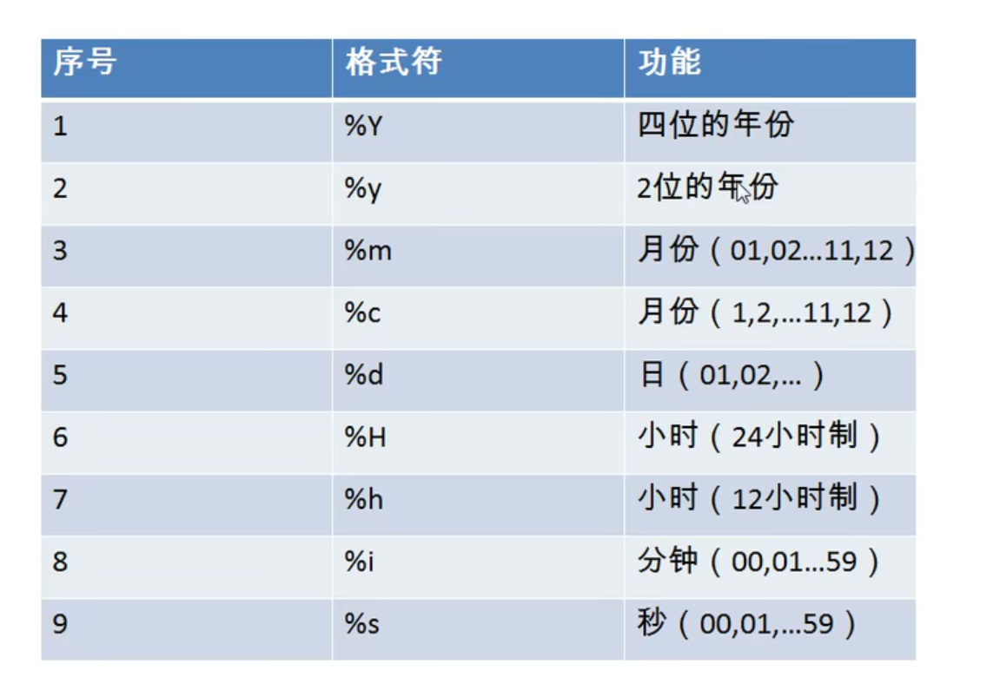

# 函数

概念：类似于方法，将一组逻辑语句封装在方法体中，对外暴露方法名

好处：

- 隐藏了实现细节
- 提高代码的重用性

调用：

```sql
select 函数名(实参列表) (from 表)
```

特点

- 函数名
- 函数功能

分类

- 单行函数(concat,length,ifnull等)
- 分组函数(做统计使用，又称为统计函数、聚合函数、组函数)

# 单行函数

- 字符函数
- 数学函数
- 日期函数
- 其他函数（补充）
- 流程控制函数（补充）

## 字符函数

1. length 获取参数值的字节个数

   ```sql
   select length('john');
   select length('张三丰hahaha');
   #对于汉字，一个汉字的字节数取决于对应的字符集,utf8为3
   ```

2. concat 拼接字符串

   ```sql
   select concat(last_name,'_',first_name) from employees;
   ```

3. upper,lower

   ```sql
   select upper('john');
   select lower('joHn');
   #案例 将姓变大写，名变小写，然后拼接
   select concat(upper(last_name),'_',lower(first_name)) from employees;
   ```

4. substr,substring

   ==索引从1开始==

   ```sql
   select substr('李莫愁爱上了陆展元',7) output;
   #截取从指定索引出指定字符长度的字符
   select substr('李莫愁爱上了陆展元',1,3) output;
   #案例 姓名中首字符答谢，其他字符小写然后用_凭借，显示出来
   select concat(upper(substr(last_name,1,1)),'_',lower(substr(last_name,2))) output;
   ```

5. instr

   返回子串第一次出现的索引，如果找不到返回0

   ```sql
   select instr('杨不悔爱上了殷六侠','殷六侠') as out_put;
   ```

6. trim

   ```sql
   select trim('    张翠山      ') as output;
   select trim('a' from 'aaaaaaaaa张翠山aaaaaa ');
   ```

7. lpad

   用指定的字符实现左填充指定长度

   ```sql
   select lpad('殷素素',10,'*') as output;
   ```

8. rpad

   用指定的字符实现右填充指定长度

   ```sql
   select rpad('殷素素',10,'*') as output;
   ```

9. replace

   替换

   ```sql
   select replace('周芷若周芷若周芷若张无忌张无忌'，'周芷若','赵敏') as output;
   ```

## 数学函数

1. round 四舍五入

   ```sql
   select round(1.65);
   select rount(1.567,2);
   ```

2. ceil 向上取整，返回>=该参数的最小整数

   ```sql
   select ceil(1.52);
   ```

3. floor 向下取整，返回<=该参数的最大整数

   ```sql
   select floor(-9.99);
   ```

4. truncate 截断

   ```sql
   select truncate(1.65,1);
   ```

5. mod 取余

   mod(a,b)   a-a/b*b

   ```sql
   select mod(-10,-3);
   select 10%3;
   ```


## 日期函数

1. now 返回当前系统日期+时间

   ```sql
   select now();
   ```

2. curdate 返回当前系统日期，不包含时间

   ```sql
   select curdate();
   ```

3. curtime 返回当前时间，不包含日期

   ```sql
   select curtime();
   ```

4. 获取指定的部分，年、月、日、小时、分钟、秒

   ```sql
   select year(now()) 年;
   select year('1998-1-1') 年;
   select year(hiredate) 年 from employees;
   select monthname(now()) 月;
   ```

5. str_to_data 将日期格式的字符转换成指定格式的日期

   

   ```sql
   select str_to_date('1998-3-2','%Y-%c-%d');
   #查询入职日期为1992-4-3的员工信息
   select * from employees where hiredate='1992-4-3';
   select * from employees where hiredate=str_to_date('4-3 1992','%c-%d %Y');
   ```

6. data_format 将日期转换成字符

   ```sql
   select data_format(now(),'%y年%m月%d日')as out_put;
   #查询有奖金的员工名的入职日期（**月/**日 **年）
   select last_name,data_format(hiredata,'%m月/%d日 %y年')as 入职日期 from employees where commission_pct is not null
   ```

7. 其他函数

   ```sql
   select version();
   select database();
   select user();
   ```

8. 流程控制函数

   ```sql
   #if if   else
   select if(10<5,'大','小');
   #case函数 使用1：switch case的效果
   /*
   case 要判断的字段或表达式
   when 常量1 then 显示的值1 或 语句1;
   when 常量2 then 显示的值2 或 语句2;
   ...
   else 要显示的值n或语句n；
   end
   */
   #查询员工的工资，要求部门号=30，显示工资为1.1倍，40，1.2倍，50，1.3倍，其他，原工资
   select salary as 原始工资,department_id,
   case department_id
   when 30 then salary*1.1
   when 40 then salary*1.2
   when 50 then salary*1.3
   else salary
   end as 新工资
   from employees;
   
   #case 使用2：类似于多重if
   /*
   case
   when 条件1 then 显示值1 或 语句1；
   when 条件2 then 显示值2 或 语句2；
   ...
   else 显示值n  或 语句n;
   end
   */
   #查询员工工资情况，如果工资>20000，显示a；>15000，b，>10000，c，否则,d
   select salary,
   case
   when salary>2000 then 'A'
   when salary>1500 then 'B'
   when salary>1000 then 'C'
   else 'D'
   end as 级别
   from employees;
   ```

   

# 分组函数

用作统计使用，又称为聚合函数或统计函数或组函数

分类

sum求和、avg平均值、max最大值、min最小值、count计算个数

## 简单使用

```sql
select sum(salary) from employees;
select avg(salary) from employees;
select max(salary) from employees;
select min(salary) from employees;
select count(salary) from employees;
select sum(salary),avg(salary) from employees;
```

## 特点

参数支持类型

- sum,avg一般用于处理数值型，max,min,count可以处理任何类型
- 以上分组函数后忽略null
- 可以和distinct搭配实现去重的运算
- count(*)统计行数
- 和分组函数一同查询的字段要求是group by后的字段

```sql
select sum(distinct salary),sum(salary) from employees;
select count(distinct salary),count(salary) from employees;
```

## count函数

```sql
select count(*) from employees;  #统计行数
select count(1) from employees;  #统计
```

==效率：==

MYISAM存储引擎下，count(*)的高

INNODB存储引擎下，count(*)和count(1)效率差不多，比count(字段)要高一些
